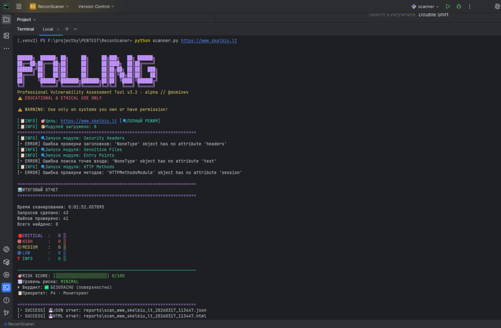

#! 🛡️ ProSecurityScanner v3.2-alpha @dominev

> Professional Reconnaissance & Triage Scanner  
> ⚠️ For educational and authorized security testing only



## Возможности

- -- Быстрое сканирование заголовков безопасности (OWASP)
- -- Risk Score 0-100 с визуализацией и вердиктом  
- -- Fast Mode: <1 сек на целевой сайт
- -- Stealth Mode: обход базовых WAF/бот-детектов
- -- Пакетное сканирование сотен целей
- -- Отчеты: JSON (машиночитаемый) + HTML (для клиента)

## Быстрый старт

```bash
# Установка
pip install -r requirements.txt

# Одиночное сканирование
python scanner.py https://target.com --fast

# Пакетное с фильтром
python scanner.py -l targets.txt --min-risk HIGH -o results.json

# Режим скрытности
python scanner.py https://target.com --stealth --delay 2

```

## 📋 Пример вывода
```bash

🎯 RISK SCORE: [████████░░░░░░░░░░░░] 44/100
📈 Уровень риска: MEDIUM  
⚡ Вердикт: 🟡 РЕКОМЕНДУЕТСЯ ПРОВЕРКА
📋 Приоритет: P2 - Средний приоритет
```

## !!! Юридическое предупреждение !!!

Используйте только на ресурсах, которыми вы владеете, или где у вас есть письменное разрешение на тестирование.
Несанкционированное сканирование может нарушать законодательство.

### Next futures:
-- v3.3 alpha с CMS-detect + CVE
* Интеграция с CVE API для проверки версий ПО
* Поддержка аутентификации (OAuth, JWT)
* Headless-браузер для обхода JS-защит

